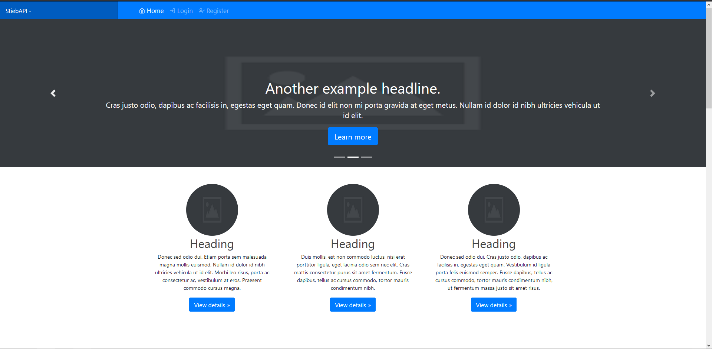
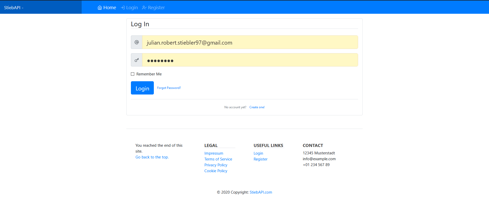
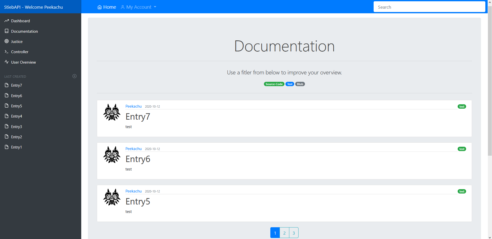
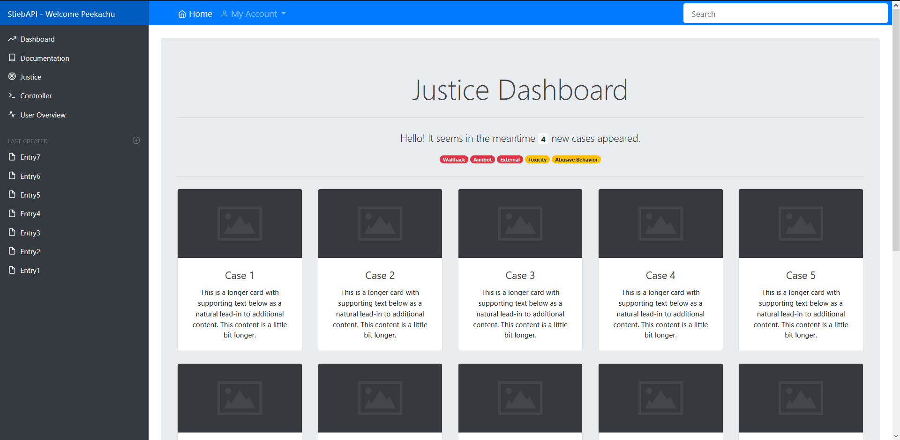

# PythonFLASK Dashboard, powered by Bootstrap

## Features `THIS PROJECT IS DEPRECATED`

* Login & Register with hashed passwords
* Forms are created by WTForms with CSRF-Tokens!
* Forgot Password? E-Mail reset avaiable!
* Uses relationships & foreign keys for specific features like newsfeed
* Create posts in a newsfeed and browse them with filters based on labels u specify and edit or remove them
* Profiles with ability to upload your own profile picture
* Custom error pages
* Project layout is done with flask blueprints
* encrypted with LetsEncrypt
s
## Main Files

* run.py - Main file, specifies port, host, debug=True/False
* requirements.txt - All used python libraries
  * __init__.py - Initializes package "website", registers an Instance of app and creates all blueprints
  * config.py - SecretKey, E-Mail ports, password is plaintext exposed, commentary's for os variables are preset
  * models.py - defines a database model based on SQLAlchemy
  * /static/ - only folder publicly exposed, all other folders are access restricted

## Recommendations

* Use HTTP headers!!
* With SQLAlchemy updates, db needs to be andled with app.app_context()
* enable jinja2 autoescaping

## ToDo (WILL NOT PROGRESS FURTHER)

* [X] Added more design
* [x] Reconstructed templates using Flask-includes
* [x] Add pygal dynamic realtime-graphs
* [x] fixed indentations of all files
* [x] fixed design flaws
* [ ] add rendering for graphs
* [ ] edit navbar, remake help-dropbar for master-account
* [ ] edit sidebar, remove Documentation-entry & Controller-entry
* [ ] rename sidebar "User-Overview" to "Ban-Overview" and maybe match for already banned SteamIDs to auto-remove done cases
* [ ] remove legal-blueprint (website/legal/..)
* [ ] remove footer from templates/layout.html
* [ ] remove follower-logic from models.py and delete its tables out of data/site.db
* [ ] remove UserGroups-table from models.py and from data/site.db
* [ ] remove Settings-table from models.py and from data/site.db
* [ ] add multifile-upload functionality as attachments for documentation with upload-folder set from website/config.py
* [ ] add bbcode/markdown support for documentation-text (documentation/routes.py & templates/documentation/..)
* [ ] add steamauth beside normal user-login/registration
* [ ] add functionality for a master-account with extra access to whitelist from webinterface or create accounts
* [ ] make use of likes-logic already set in models.py and migrated to data/site.db to mirror judgements
* [ ] make use of Roles/UserRole-logic already set in models.py and migrated to data/site.db
* [ ] make use of Comment-logic already set in models.py and migrated to data/site.db
* [ ] make use of notification-logic already set in models.py and migrated to data/site.db
